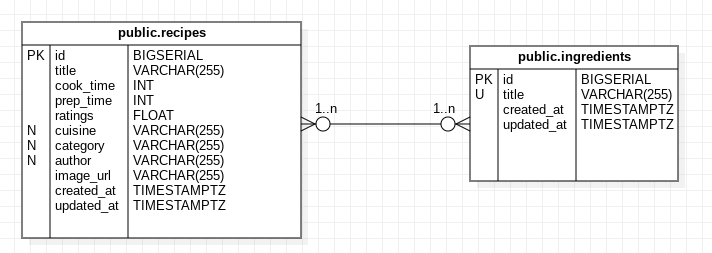

# Scaling Waffle

## Installation

Everything is set up with Docker, you should be able to simply run :

```sh
docker compose up

# set up the database
docker compose exec api sh -c 'rails db:setup'
```

The application will then be available at `localhost:3000`.

## Testing

To run tests, a specific docker compose service exists :

```sh
docker compose run --rm tests
```

## Database structure

A very simple structure that allows to keep each ingredient as a unique identifier.

Note ActiveRecord's internal tables are intentionally ignored.



## Improvements

- It would probably be a good idea to add a tsvector column to recipes
  to drastically improve the performance of the search feature

- A seperate Next application would be more flexible to expand further, while
  also getting some bonus benefits (SSR, routing, etc)

- Adding the filters and current page in the URL (or local storage) would allow
  to reuse them when reloading the list
